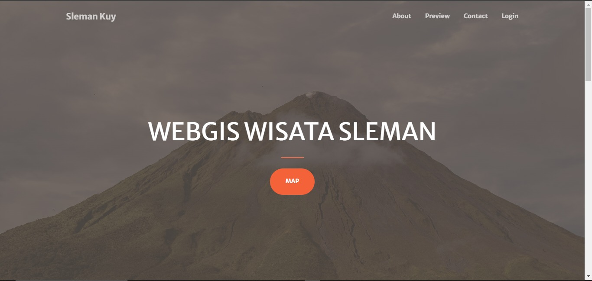
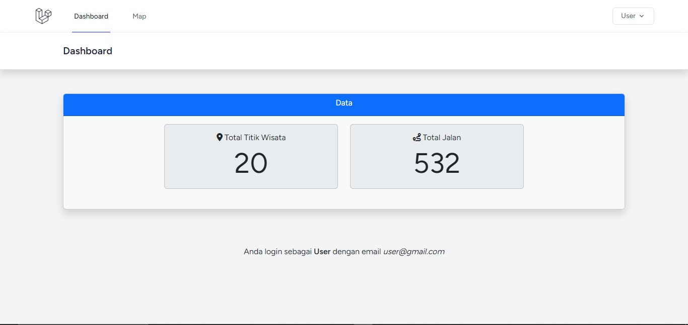
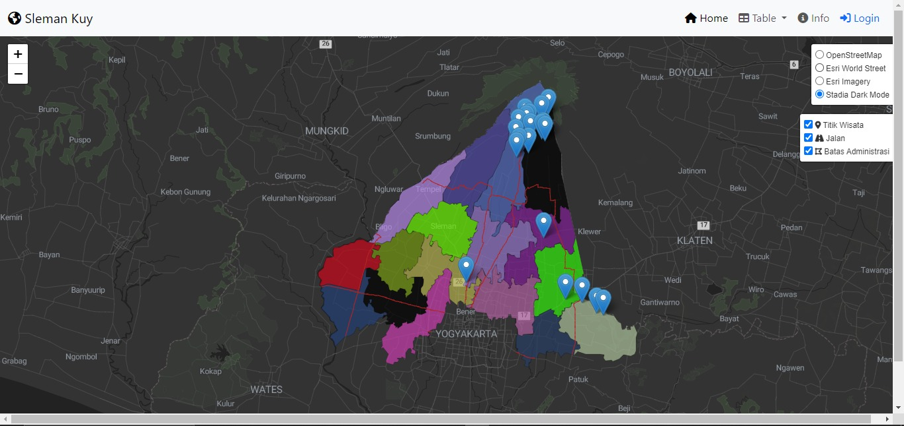
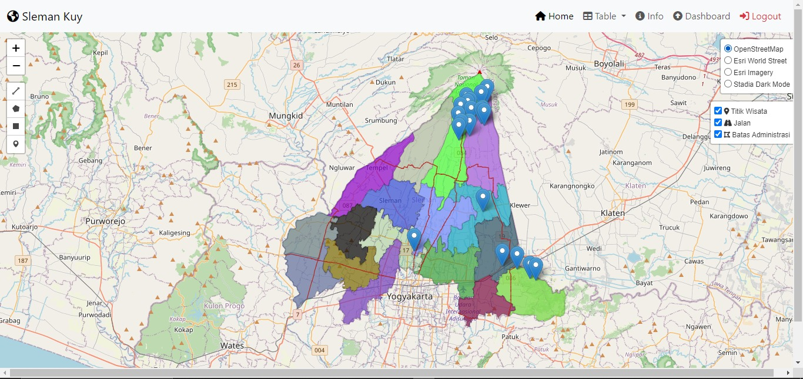
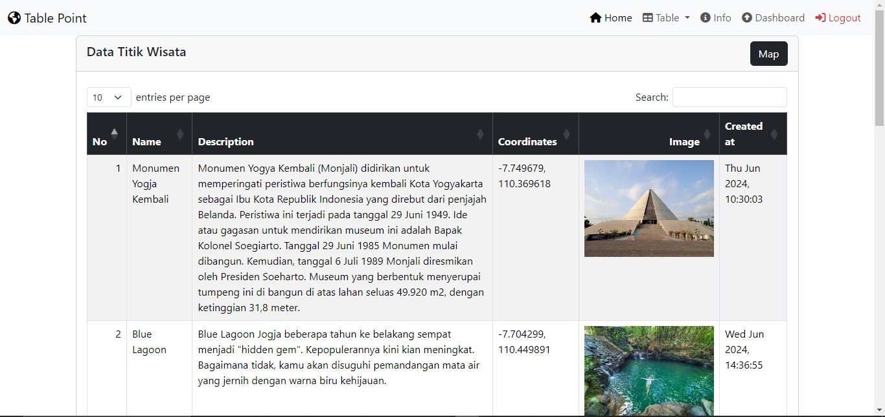

# Nama Project = "Sleman Kuy"
## Deskripsi = WebGIS Destinasi Wisata Sleman adalah aplikasi berbasis web yang menyediakan informasi interaktif mengenai destinasi wisata di Kabupaten Sleman. Aplikasi ini memungkinkan pengguna untuk mengakses data geografis dan informasi lengkap tentang berbagai tempat wisata, membantu mereka merencanakan kunjungan dengan lebih baik.

## Komponen = 
1. **Frontend**: 
   - HTML
   - CSS
   - JavaScript
   - Bootstrap
2. **Backend**:
   - Python
3. **Database**:
   - PostgreSQL
   - PostGIS
4. **GIS Tools**:
   - Leaflet.js
   - GeoJSON

## Sumber Data = 
1. **Data Wisata**: Dinas Pariwisata Kabupaten Sleman
2. **Sumber Tambahan**: OpenStreetMap, Google Maps API

## Preview WebGIS

### Tampilan Landing Page

### Tampilan Dashboard

### Tampilan Peta Public

### Tampilan Peta

### Tampilan Tabel

